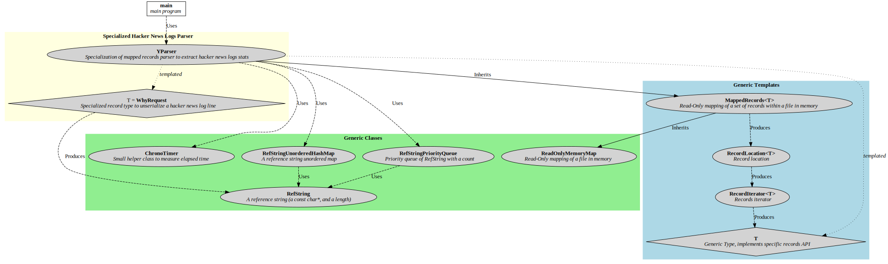

# hnStat

## This Document

This document describes the problem we want to solve with the program, inluding the hypothesis inferred, and the solution found.

## The problem

The goal is to parse large request logs from ycombinator search backend, and extract top request statistics (count of unique queries, and k top queries), given a timeframe (the whole log by default).

## Build

* Environment
   * Linux (tested with x86-64 platform)
* Prerequisites `apt-get install g++ make valgrind groff graphviz`
   * gcc (C++11-aware) (tested with gcc 6.3.0)
   * make
   * valgrind (for tests)
   * groff (for man page)
   * graphviz (for svg graphs)
* Building
   * `make`
      * you may have to remove `-Werror` in the Makefile with some gcc releases detecting incorrectly uninitialized pathes (GCC 7.x)
* Testing
   * `make tests`
   * Examples
      * `./hnStat distinct hn_logs.tsv`
      * `./hnStat top 10 hn_logs.tsv`
      * `./hnStat top 10 --from=1438480794 --to=1438508805 hn_logs.tsv`

## The assumptions made

* Given a timeframe, all unique requests can be held in memory; the typical sample provided sees to infer that this is not an issue, even with a very large timeframe (eg. a year)
* Query log file can be potentially huge, even if small time window are used afterwards for queries
* The logs are not strictly sorted by timestamp; but seems to be *loosely* sorted (ie. time jitter seems never higher than 5 minutes). A possible explaination is that multiple backends were collected in a single file, with 5-minute slices (cron job-like), leading to local time discrepancies. A default optimization has been made to take advantage of this (seeking the desired timeframe minus 15 minutes) - this optimization can be either tuned (`--jitter=seconds`) or disabled entirely if desired (`--fast-seek=no`).
* Queries sems URL-encoded (RFC 3986); but no decoding is done as suggested in the example, assumming of the unicity of encoding (ie. not directly upstream client GET request but re-encoded queries)

## The overall design

A binary search is used to seek within the file, an unordered map to count the queries, and a min-priority queue to select the k top queries.

0. [Arguments are parsed and validated, and the file opened]
1. Optional binary search inside the text file (on a line start boundary) to locate approximate (with default 15-minutes jitter) start [cpu: O(log(total_number_of_lines))]
2. Sequential read of records (lines), optionally filtering by range, inserted in an unordered map [cpu: O(number_of_bytes_in_range) (hashtable) memory: O(unique_queries) i/o: O(number_of_bytes_in_range)]
   1. Count of unique queries: print the number of unique queries (cpu: O(1))
   2. Emit k top queries: Enumerate the hashtable, inserting new maximums in a min-priority queue [cpu: O(unique_queries)+O(unique_queries*log(k))]

## Complexity

* Counting unique queries in a range
  * cpu: O(log(total_number_of_lines)) + O(number_of_bytes_in_range)
  * memory: O(unique_queries)
  * i/o: O(number_of_bytes_in_range)
* Extracting k top queries in a range
  * cpu: O(log(total_number_of_lines)) + O(number_of_bytes_in_range) + O(unique_queries) + O(unique_queries*log(k))
  * memory: O(unique_queries)
  * i/o: O(number_of_bytes_in_range)

## The technical details

0. Typical getopt-like parsing of arguments, and file mapped in memory (read-only), with proper VM hints (random access vs. linear access)
1. Optionally, custom-made binary search to locate desired line, taking in account jitter (15 minutes by default)
2. Lines records read, fitered (time rangen, or invalid/empty lines), and inserted in the `std::unordered_map<>`. Key is basically an object (see RefString class) referencing mapped data string, with a length, to spare a bit of memory (vs. `std::string`).
   1. Counting unique queries is trivial (this is the size of the hashtable so far)
   2. Extracting k top queries involves inserting highest candidates in a `std::priority_queue<>` (the top of the queue being the first candidate to replace), and reverting the queue through a vector at the end (to print in descending order)

## The implementation files

* C++ implementation
   * [`main.cpp`](main.cpp) Parsing commandline arguments, calling parser to load and scan the file, output desired statistics
   * [`yprocessing.hpp`](yprocessing.hpp) [`yprocessing.cpp`](yprocessing.cpp) Specialization of mapped records parser to extract hacker news logs stats
   * [`yrequest.hpp`](yrequest.hpp) [`yrequest.cpp`](yrequest.cpp) Specialized record type to unserialize a hacker news log line
   * [`refstringmap.hpp`](refstringmap.hpp) Represent a string, with outer buffer pointing to an external const reference
   * [`records.hpp`](records.hpp) An abstract generic "record" reader on top of a mapped file
   * [`chrono.hpp`](chrono.hpp) Small helper class to measure elapsed time
   * [`mappedfile.hpp`](mappedfile.hpp) [`mappedfile.cpp`](mappedfile.cpp) Class aimed to handle memory mapping of a file (read-only)
* Tests
   * [`test-suite.sh`](test-suite.sh) The tests suite
   * [`parser.py`](parser.py) Alternate Python implementation for tests
* Documentation
   * [`hnStat.1`](hnStat.1) Manpage source
   * [`README.md`](README.md) This file
   * [`LICENSE`](LICENSE) License file (BSD 2-Clause "Simplified" License)

## Classes

This is an attempt to describe the classes and their interactions.

## Tests

* Unit tests (automated tests)
* Validation of the exercice spirit was done with full range (automated tests)
* Various error cases and commandline validation (automated tests)
* A basic alternate implementation in Python was used to validate the program (parser.py) against the big sample file (automated tests)

Example:

`python parser.py top 10 hn_logs.tsv`

## Torture tests

* running hnStat on `/bin/bash` or tar.gz file (binary files) does not cause erroneous (ie. crashes, etc.) behavior

`for f in /usr/lib/x86_64-linux-gnu/*.so; do hnStat top 10 "$f" >/dev/null; done`

This torture test has been merged in automated tests.

## Leaks

* `valgrind` executed in a basic tests (automated tests)
* `valgrind` executed on hnStat with various patterns without any worrying reports

## What might have been too much

*ie. did take more time than envisioned, and increased overall complexity*

* The binary search to optimize `--from` might have been a bit overkill for the exercise
* The zero-string hashmap (ie. using references to mapped read-only file data instead of `std::string` as hash map keys) was also probably too much
* Genericity was probably not a strong requirement (especially for the templated MappedRecords), even if this helped splitting the code logic/layers

## What is missing (sorry)

* gprof analysis
* A bit more API doc sould have been written in real life, probably
* Classes diagram is a bit messy
* More automated tests ?
